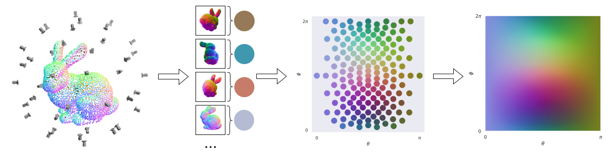
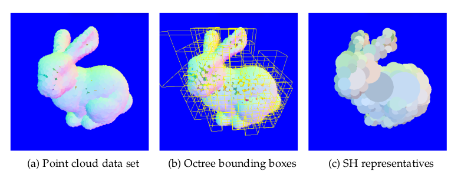
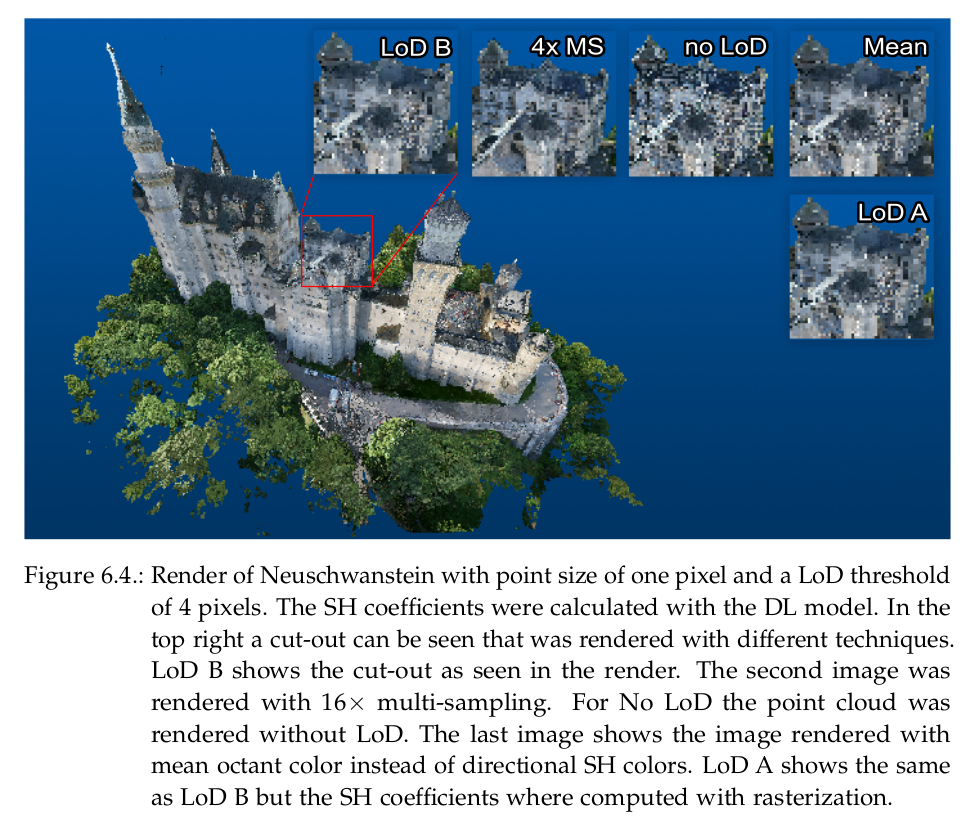

# puntum - Point Cloud Renderer

This repository contains the code for my master thesis with the title "Learning Level of Detail for Point Cloud
Rendering".
It contains the code for the renderer and the deep learning model.

**Abstract**:
This thesis presents a novel level of detail (LoD) point cloud rendering approach that
accurately approximates the directional color of point groups using spherical harmonics.
The method is a form of mipmapping for point clouds and improves rendering accuracy
and reduces artifacts like aliasing and flickering.
We organize the point cloud into an octree and encode the directional color of each
node in the tree with spherical harmonics. Nodes that are small in screen space are
rendered as a single point whose color is the average color emitted from the node
towards the camera. In addition to a rasterization approach we also propose a deep
learning (DL) model that calculates the spherical harmonics coefficients required to
calculate the directional color during rendering. We evaluate the presented rendering
method on various datasets and show that our method improves rendering quality for
high density point clouds and can be used to partially approximate a multi-sampled
render. Furthermore, the proposed DL model is assessed, and the directional colors
computed by it compared to the rasterization approach. We show that the model can
compute suitable coefficients 3.5 times faster than the rasterization approach.




## Renderer

The renderer is written in Rust and uses the library [vulkano](https://github.com/vulkano-rs/vulkano) for rendering with the Vulkan API.

### Preparing a point cloud

Before a point cloud can be rendered it needs to be converted into an octree structure containing the precomputed directional colors:
```
cargo run --release build_octree --bin <input_file> <output_file>
```
Usage:
```
Octree Builder 0.1.0

USAGE:
    offline_render [OPTIONS] <input_octree> <output_file>

FLAGS:
        --help       Prints help information
    -V, --version    Prints version information

OPTIONS:
    -h, --height <height>                   [default: 256]
        --lod-threshold <lod-threshold>    LoD threshold in pixels [default: 1]
    -w, --width <width>                     [default: 256]
    -x, --x-camera <x-camera>               [default: 0.]
    -y, --y-camera <y-camera>               [default: 0.]
    -z, --z-camera <z-camera>               [default: 0.]

ARGS:
    <input_octree>    
    <output_file>  
``` 

PLY files and LAZ files are supported as input format. The output file will contain the octree data structure.
Adding the flag `--help` will prompt all options for the tool.

**NOTE:** If a deep learning model should be used for the coefficient calculation, it has to be specified with `--sh-model <model_file>`. 




### Opening the renderer

The interactive renderer can be invoked with:

```
cargo run --release --bin viewer <octree_file>
``` 

Usage:
```
puntum Viewer 0.1.0

USAGE:
    viewer [OPTIONS] <input_octree>

FLAGS:
    -h, --help       Prints help information
    -V, --version    Prints version information

OPTIONS:
        --height <height>    initial window height [default: 540]
        --width <width>      initial window width [default: 720]

ARGS:
    <input_octree>  
```


There is also an offline renderer that will render the point cloud with given settings and save the render to an image:

```
cargo run --release --bin offline_render [OPTIONS] <input_octree> <output_image>
``` 



## Deep Learning Model

The model is used to approximate the spherical harmonics coefficients for the directional color of octants.
It is written in [pytorch](https://pytorch.org/).

### Installation

The requirements can be installed with [Anaconda](https://www.anaconda.com/):
``` 
conda env create --file=environment.yaml
```

### Training


The model is based on [PointNet](https://web.stanford.edu/~rqi/pointnet/) and the code for it can be found in  the [pointnet](pointnet/) folder.

A model can be trained with the [train.py](train.py) script:
```
usage: train.py [-h] [--batch-size BATCH_SIZE] [--l L_MAX] [--epochs EPOCHS] [--checkpoint CHECKPOINT] name dataset

Train pointnet

positional arguments:
  name                  experiment name
  dataset               folder containing the dataset

options:
  -h, --help            show this help message and exit
  --batch-size BATCH_SIZE
                        batch size used for training
  --l L_MAX             maximum coef. degree to train model with
  --epochs EPOCHS       number of training epochs
  --checkpoint CHECKPOINT
                        checkpoint to load
```

the logs will be saved to `./logs/<name>` and can be opened with [TensorBoard](https://www.tensorflow.org/tensorboard/).
In addition to that, a TorchScript model, that can be used for the octree_build tool, is saved to the logs folder.

### Dataset generation

A dataset is created from an octree that was created with the `build_octree` tool (see [here](#preparing-a-point-cloud)).
The script creates a ply file for every leaf node:

Usage:
```
Dataset generator 0.1.0

USAGE:
    gen_dataset [FLAGS] <input_octree> <output>

FLAGS:
        --export-images    saves the individually rendered images as pngs WARNING: this createa A LOT of images  (162
                           per octant)
    -h, --help             Prints help information
        --measure          if set no ply files are exported (used for performance measurement)
    -V, --version          Prints version information

ARGS:
    <input_octree>    octree file
    <output>          target folder where the ply files will be saved to
```

The script [calc_sh.py](calc_sh.py) calculates the spherical harmonics coefficients for each ocatant and saves the point cloud and coefficients as a ply file:

```
usage: calc_sh.py [-h] [--l_max L_MAX] [--no-export] in_folder out_folder

Calculate Spherical Harmonics for perspective colors

positional arguments:
  in_folder      ply file with camera positions and their perceived colors
  out_folder     ply file where results will be written to

options:
  -h, --help     show this help message and exit
  --l_max L_MAX  maximum order of spherical harmonics coefficients to calculate
  --no-export    do not export ply files
```

The resulting folder can be used as a dataset for model training.